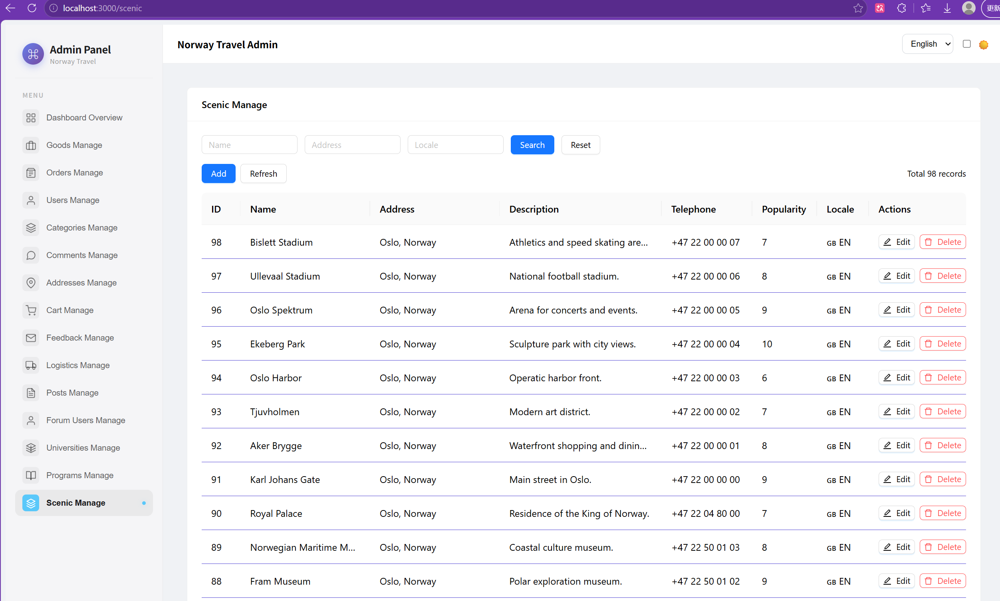
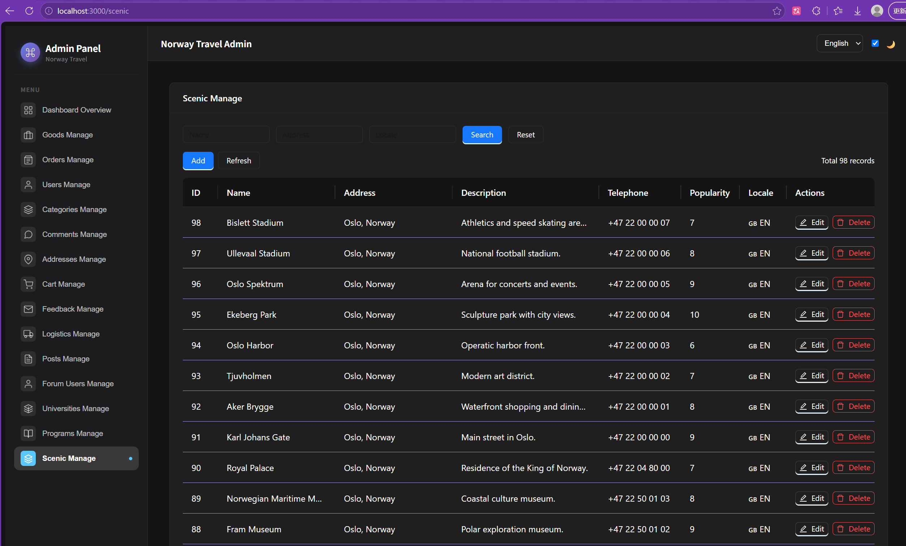
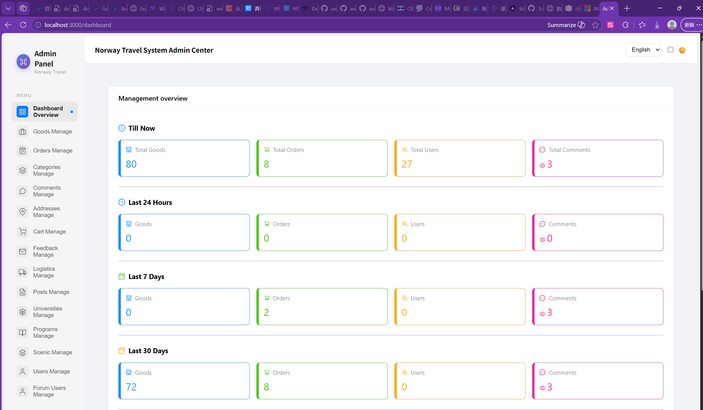
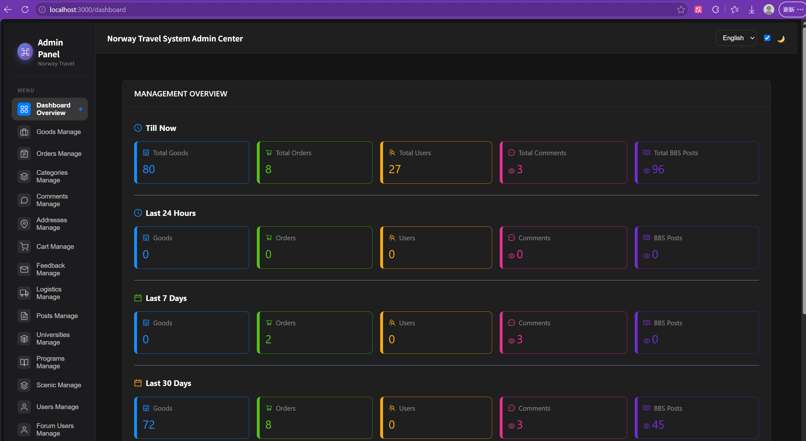

# tourism_in_norway

A Flutter project which create by Flutter SDK, Dart language, Node.js, Express.js, MySQL. Pls feel free contact by m13692277450@outlook.com if you are interesting with it.

## **If you like and support this project, pls conside support me by below link:**

License: MIT License.

## Getting Started

This project is a  Flutter application about travle information in the part of Europe. now it's designing in progress about Norway.
should be done in one month.

.jpg>)

.jpg>)

.jpg>)

.jpg>)

.jpg>)

.jpg>)

.jpg>)

.jpg>)

## Backend Admin Panel:

### Light Mode

### Dark Mode

### Dashboard light mode

### Dashboard dark mode

## **If you like and support this project, pls conside support me by below link:**

License: MIT License.

"# Tourism_In_Norway" 
